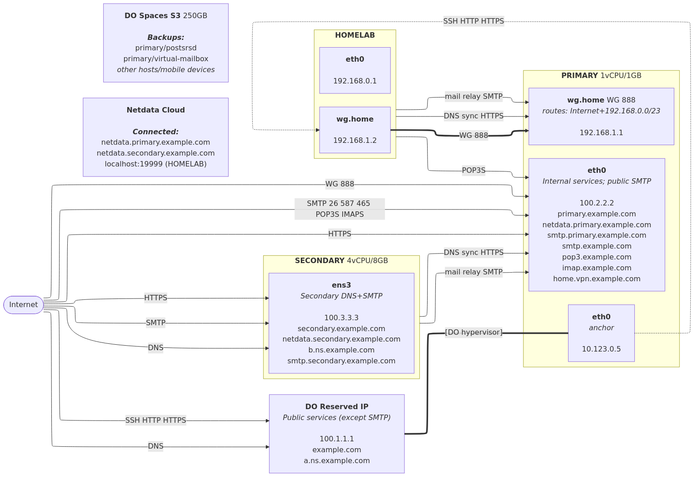

# Servers

## Overview

## Addresses

| Host      | IP             | Interface      | Purpose                                  |
| --------- | -------------- | -------------- | ---------------------------------------- |
| PRIMARY   | 100.1.1.1      | DO Reserved IP | `example.com` — public entry point       |
| PRIMARY   | 100.2.2.2      | eth0           | `primary.example.com` — direct access    |
| PRIMARY   | 10.123.0.5     | eth0 (anchor)  | Port forwarding source (DNAT to HOMELAB) |
| PRIMARY   | 10.133.0.2     | eth1 (private) | DO private network (unused)              |
| PRIMARY   | 192.168.1.1/23 | wg.home        |                                          |
| SECONDARY | 100.3.3.3      | ens3           | `secondary.example.com`                  |
| HOMELAB   | 192.168.0.1    | eth0           | home server                              |
| HOMELAB   | 192.168.1.2    | wg.home        | WireGuard peer in Home VPN               |

## DNS

| Zone          | Primary NS            | Secondary NS |
| ------------- | --------------------- | ------------ |
| `example.com` | PRIMARY (Reserved IP) | SECONDARY    |

Secondary DNS servers pull zone data periodically over HTTPS.

## VPN

|          | Home (wg.home)             |
| -------- | -------------------------- |
| Endpoint | `home.vpn.example.com:888` |
| Subnet   | 192.168.0.0/23             |
| Routes   | Internet + Home            |
| Users    | me, my mobile devices      |

## Port Forwarding

Traffic to `example.com` (Reserved IP) on ports SSH, HTTP, HTTPS
is forwarded via nftables DNAT from `10.123.0.5` (anchor) to `192.168.1.2` (HOMELAB via wg.home).
Hairpin NAT is configured so VPN clients can also reach `example.com`.

## Services

### PRIMARY (DigitalOcean, 1 vCPU / 1 GB)

| Service             | Public Ports      | Access       | Notes                                    |
| ------------------- | ----------------- | ------------ | ---------------------------------------- |
| nftables            | —                 | —            | Firewall; port forwarding                |
| dcron               | —                 | —            | Backups (duplicity → S3); Log rotation   |
| WireGuard Home      | 888/udp           | Auth         | Routes: Internet + Home                  |
| tinydns-wan         | 10.123.0.5:53/udp | Public       | `a.ns.example.com` DNS authoritative     |
| axfrdns-wan         | 10.123.0.5:53     | Public       | `a.ns.example.com` DNS zone-transfer     |
| Caddy               | 443, 443/udp      | Public       | Reverse proxy; ACME for all services     |
| Postfix SMTP        | 25, 26            | Public; Auth | Primary MX; port 26 for ISPs blocking 25 |
| Postfix Submission  | 587, 465          | Auth         | (unused for now)                         |
| OpenDKIM            | —                 | Internal     | Mail signing/verification                |
| OpenDMARC           | —                 | Internal     | Mail authentication                      |
| PostSRSd            | —                 | Internal     | Mail sender rewriting                    |
| Postgrey            | —                 | Internal     | Mail greylisting                         |
| Courier auth        | —                 | Internal     | Mailbox users                            |
| Courier IMAP        | 993               | Auth         | Mailbox; TLS only                        |
| Courier POP3        | 995               | Auth         | Mailbox; TLS only                        |
| docker-socket-proxy | —                 | Internal     | Restrict access to `docker.sock`         |
| postfix-exporter    | 127.0.0.1:9154    | Public       | Prometheus metrics for Postfix           |
| Netdata             | 127.0.0.1:19999   | Public       | Exposed by Caddy                         |

#### Caddy websites

| Auth  | URL                                       | Notes            |
| ----- | ----------------------------------------- | ---------------- |
| Basic | <https://netdata.primary.example.com>     | localhost:19999  |
| Basic | <https://primary.example.com/djbdns/data> | a.ns.example.com |

### SECONDARY (OVHcloud US, 4 vCPU / 8 GB)

| Service             | Public Ports    | Access   | Notes                                |
| ------------------- | --------------- | -------- | ------------------------------------ |
| nftables            | —               | —        | Firewall                             |
| dcron               | —               | —        | Log rotation                         |
| tinydns-secondary   | 53/udp          | Public   | `b.ns.example.com` DNS authoritative |
| axfrdns-secondary   | 53              | Public   | `b.ns.example.com` DNS zone-transfer |
| Caddy               | 443, 443/udp    | Public   | Reverse proxy; ACME for all services |
| Postfix SMTP        | 25              | Public   | Secondary MX; Relays to Primary MX   |
| Postgrey            | —               | Internal | Mail greylisting                     |
| docker-socket-proxy | —               | Internal | Restrict access to `docker.sock`     |
| postfix-exporter    | 127.0.0.1:9154  | Public   | Prometheus metrics for Postfix       |
| Netdata             | 127.0.0.1:19999 | Public   | Exposed by Caddy                     |

#### Caddy websites

| Auth  | URL                                     | Notes           |
| ----- | --------------------------------------- | --------------- |
| Basic | <https://netdata.secondary.example.com> | localhost:19999 |

### HOMELAB (Home)

| Service             | Public Ports    | Access   | Notes                            |
| ------------------- | --------------- | -------- | -------------------------------- |
| docker-socket-proxy | —               | Internal | Restrict access to `docker.sock` |
| Netdata             | 127.0.0.1:19999 | Public   | Monitoring                       |
| Ollama              | 127.0.0.1:11434 | Public   | LLM inference (NVIDIA GPU)       |

## Email

| Role             | Host      | Address                                 |
| ---------------- | --------- | --------------------------------------- |
| Primary MX       | PRIMARY   | `smtp.primary.example.com:25` and `:26` |
| Secondary MX     | SECONDARY | `smtp.secondary.example.com:25`         |
| SMTP submission  | PRIMARY   | `smtp.example.com:587` (STARTTLS)       |
| SMTP submissions | PRIMARY   | `smtp.example.com:465` (implicit TLS)   |
| POP3S            | PRIMARY   | `pop3.example.com:995`                  |
| IMAPS            | PRIMARY   | `imap.example.com:993`                  |

- DO does not allow SMTP on Reserved IP,
  so MX for `example.com` domain cannot use `example.com` host.
- Secondary MX accepts mail and relays it to Primary MX.
- Mail pipeline on PRIMARY:
  Postfix → OpenDKIM → OpenDMARC → Postsrsd → Postgrey → delivery.
- Virtual domains:
  - `example.com`

## Monitoring

Netdata runs on every server with `network_mode: host` and Telegram alerts.
Docker API access goes through `docker-socket-proxy` (read-only, limited endpoints).

| Server    | URL                                      | Access         |
| --------- | ---------------------------------------- | -------------- |
| PRIMARY   | <https://netdata.primary.example.com/>   | Basic auth     |
| SECONDARY | <https://netdata.secondary.example.com/> | Basic auth     |
| HOMELAB   | <http://localhost:19999/>                | Localhost only |
| All       | <https://app.netdata.cloud/>             | Netdata Cloud  |

Netdata Cloud provides a unified dashboard across all instances
but each one must be connected manually.

## Backups

Only PRIMARY runs backups (duplicity + rclone → DigitalOcean Spaces S3).
GPG-encrypted. Daily incremental, full monthly. Retention: 5 full + 3 incremental chains.

| Profile         | Volume            | Data                 | Notes |
| --------------- | ----------------- | -------------------- | ----- |
| virtual-mailbox | `virtual-mailbox` | All email (Maildir)  |       |
| postsrsd        | `postsrsd-data`   | SRS address mappings |       |

**Not backed up** (by design):
TLS certs (auto-renewed), DNS zones (in git), Courier userdb (in fnox),
all service configs (generated from git templates), Docker images (rebuilt),
Netdata state (disposable), Ollama models (re-downloadable).

Restore: `docker exec dcron /etc/duplicity/restore.sh <profile>`

## Operational Notes

### DigitalOcean Reserved IP

DO Reserved IP (`100.1.1.1`) is not assigned to a network interface.
The hypervisor intercepts outgoing packets from eth0 anchor IP (`10.123.0.5`)
and rewrites their source to the Reserved IP.
Incoming packets to the Reserved IP are delivered to the anchor IP.
Services must bind to the anchor IP (not the Reserved IP) to receive traffic.

### .msmtprc in mail-sending containers

Containers that need to send email (e.g. `dcron`) must:

1. Be connected to the `mail` Docker network.
2. Include an `.msmtprc` config pointing to the `postfix` container as the SMTP relay.

### Firewall (nftables)

nftables rules run with `network_mode: host`
and are re-applied idempotently on container restart.
Priority is set to run before Docker's own NAT chains (`dstnat - 2`, `srcnat + 1`).
Docker's filter chains (`DOCKER-USER` etc.) are pre-created to avoid errors.

### Managing mail user accounts (Courier userdb)

To manage mail accounts via `srv/*/courier/authlib/upsert_user.sh`,
install `courier-authlib-userdb` locally (provides `userdb` and `userdbpw` commands).

### Extra Setup (manual)

#### Mail

Configure DNS PTR records using hosting control panel.

#### DigitalOcean: disable agent

Protect against easy unauthorized SSH access by DO:

- Set root password.
- `apt remove droplet-agent droplet-agent-keyring`
- `rm /etc/apt/sources.list.d/droplet-agent.list`
